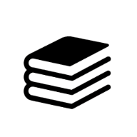

<!-- PROJECT LOGO -->
 

  

  <h3 align="center">Library Tower</h3>

  

    A minimalist library to read public domain books.
    <a href="https://library-tower.vercel.app">Check the website.</a>
  

<!-- ABOUT THE PROJECT -->
## About The Library 

[![Product Name Screen Shot][product-screenshot]](https://library-tower.vercel.app)

This is a portfolio project, i wanted to learn React, TypeScript and Tailwind.

 * I built the library with Next.js and added type safety with TypeScript.

 * It has a minimalistic design styled with TailwindCSS.

 * The public domain books are hosted in Supabase.

### Built With

Next.js: Front-end framework for building React applications.

Supabase: Backend platform for user authentication, database management.

TailwindCSS: A utility-first CSS framework.

* [![Next][Next.js]][Next-url]
* [![Supabase][Supabase]][Supabase-url]
* [![Tailwind][Tailwind]][Tailwind-url]

<!-- CONTACT -->
## Contact

Miloua Mokhtar - [LinkedIn](https://www.linkedin.com/in/mokhtar-miloua/) - <a href = "mailto: miloua23@gmail.com">Email</a>

Website: [mokhincode.com](https://mokhincode.com)

<!-- MARKDOWN LINKS & IMAGES -->
<!-- https://www.markdownguide.org/basic-syntax/#reference-style-links -->
[Next.js]: https://img.shields.io/badge/next.js-000000?style=for-the-badge&logo=nextdotjs&logoColor=white
[Next-url]: https://nextjs.org/
[Tailwind]: https://img.shields.io/badge/tailwindcss-000000?style=for-the-badge&logo=tailwindcss
[Tailwind-url]: https://tailwindcss.com/
[Supabase]: https://shields.io/badge/supabase-black?logo=supabase&style=for-the-badge
[Supabase-url]: https://supabase.com/
[product-screenshot]: ./public/library.PNG
